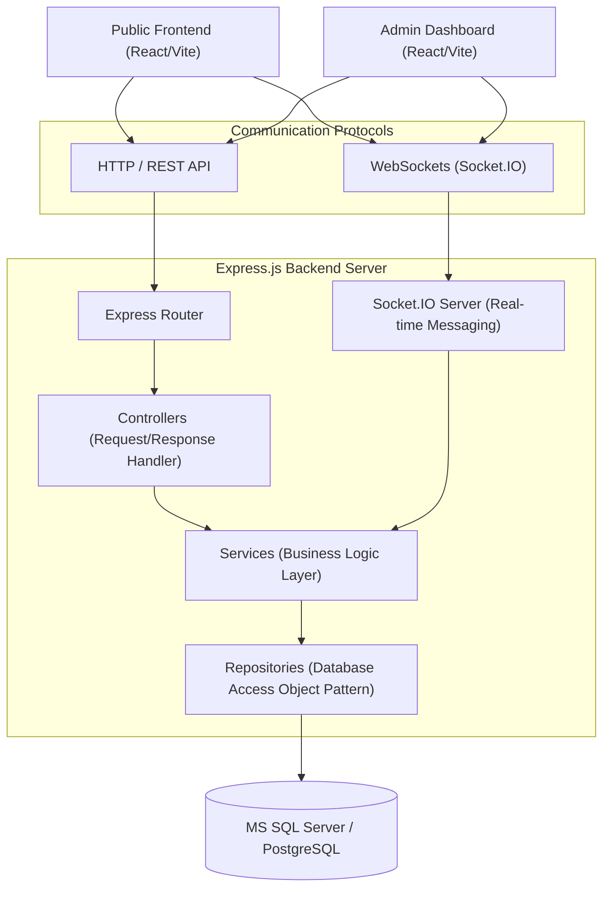

# System Architecture

The Rarenest platform is built with a highly decoupled, three-tier architectural layout. By segregating the codebase into a frontend client, administrative control dashboard, and centralized backend API, the application guarantees scalability, robustness, and ease of deployment.

## Structural Architecture Diagram

## Repository-Service-Controller Design Pattern

The Backend application strictly adheres to the **Repository-Service-Controller** architecture. This enforces separation of concerns:

1. **Controller Layer (`src/controllers/`)**:
   - Handles the incoming HTTP request.
   - Extracts data from route parameters, query strings, cookies, and HTTP request body.
   - Validates input schemas (or delegates to validator middlewares).
   - Invokes the corresponding Service layer functions.
   - Formulates and dispatches the HTTP response with standard status codes.

2. **Service Layer (`src/services/`)**:
   - Implements core business logic, domain rules, and orchestrations.
   - Handles complex transactions, token generation, parsing, notification triggers, and integrates third-party components (e.g. SMTP emails, SMS, external services).
   - Invokes Repositories for database persistence operations.
   - Does not have direct awareness of Express request/response structures, enabling reusability (e.g. by WebSockets or CLI tasks).

3. **Repository Layer (`src/repositories/`)**:
   - Executes granular database CRUD queries using MS SQL query pools.
   - Directly maps fields to query parameters to prevent SQL injection.
   - Avoids business logic, acting as an abstraction layer over SQL statements.

## Real-Time Socket.IO Synchronization

Real-time interactions are enabled using **Socket.IO**:
- The socket connection handshakes with JWT authentication (using shared cookies or authorization headers).
- Rooms are created dynamically for users (`user:${userId}`) and chat threads (`conv:${conversationId}`).
- Events are distributed securely to authorized participants only, keeping chats and notifications real-time.
