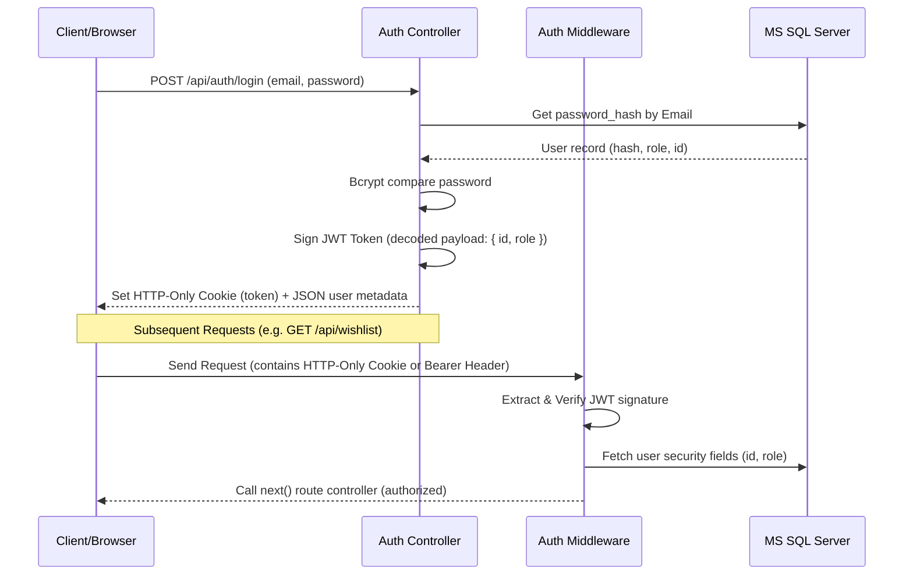

# Authentication & Authorization Flow

Rarenest uses JSON Web Tokens (JWT) for session management and authorization verification.

## 1. Authentication Mechanics



## 2. Token Delivery & Storage

*   **Cookies**: Upon login or registration, the backend service issues a JWT token set as an HTTP-Only, Secure cookie named `token`. This mitigates Cross-Site Scripting (XSS) risks since browser-side Javascript cannot read HTTP-Only cookies.
*   **Bearer Header**: For cross-origin clients (e.g. widgets or standalone sites that do not share root domain cookie space), the API also yields the JWT string inside the JSON response body under `token`. Clients can supply this in the `Authorization: Bearer <Token>` HTTP header.

## 3. Route Guard Middleware

The backend protects routes using middleware located in `backend/src/middlewares/`:

### Auth Middleware (`authMiddleware.js`)
*   Extracts the token from cookies (`req.cookies.token`) or authorization headers (`Bearer <token>`).
*   Verifies the token using `jsonwebtoken` against `process.env.JWT_SECRET`.
*   Retrieves basic user details via `userRepository.findAuthFieldsById()`.
*   Attaches the user object to the request object (`req.user`).

### Role-Based Access Control Middleware (`roleMiddleware.js`)
*   Validates that the authenticated user possesses the correct roles.
*   **Example Usage in Router**:
    ```javascript
    const { authenticate, authorize } = require('../middlewares/authMiddleware');
    
    // Only Admin role can access this route
    router.put('/verify/:id', authenticate, authorize('Admin'), verifyPropertyController);
    ```

## 4. Frontend Route Protection (React)

In `frontend/src/features/auth/` and `admin/src/features/auth/`:
*   A custom context (`AuthContext`) wraps the applications, maintaining state of the currently logged-in user.
*   Routes are managed using wrapper components (e.g. `ProtectedRoute` / `AdminRoute`). If a non-logged-in user accesses a guarded route, they are automatically redirected to `/login`.
*   If a regular user tries to access `/admin`, they are redirected back to the public homepage or the admin landing area.
