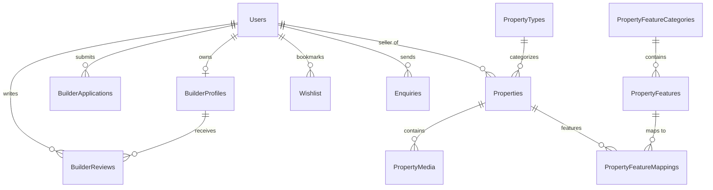

# Database Schema & Structure

Rarenest uses a relational database schema designed for MS SQL Server. Standard primary keys are configured as `UNIQUEIDENTIFIER` using `DEFAULT NEWID()` to provide robust GUID records across environments.

## Entity Relationship Overview

## Database Tables Specification

### 1. Users
Stores all system identities (buyers, builders, administrators).
*   `id`: `UNIQUEIDENTIFIER` (PK, Default: `NEWID()`)
*   `email`: `NVARCHAR(255)` (Unique, Indexed)
*   `password_hash`: `NVARCHAR(MAX)`
*   `first_name`: `NVARCHAR(100)`
*   `last_name`: `NVARCHAR(100)`
*   `phone`: `NVARCHAR(20)`
*   `role`: `NVARCHAR(20)` (Constraint: `'User'`, `'Admin'`. Default: `'User'`)
*   `created_at`: `DATETIME` (Default: `GETDATE()`)

### 2. BuilderProfiles
Created when a user's `BuilderApplication` is approved.
*   `id`: `UNIQUEIDENTIFIER` (PK)
*   `user_id`: `UNIQUEIDENTIFIER` (FK references `Users.id` ON DELETE CASCADE)
*   `bio`: `NVARCHAR(MAX)`
*   `average_rating`: `DECIMAL(3, 2)`
*   `total_reviews`: `INT`
*   `builder_status`: `NVARCHAR(20)` (Constraint: `'Pending'`, `'Approved'`, `'Rejected'`)

### 3. BuilderApplications
Applications containing verification documentation.
*   `id`: `UNIQUEIDENTIFIER` (PK)
*   `user_id`: `UNIQUEIDENTIFIER` (FK references `Users.id` ON DELETE CASCADE)
*   `company_name`: `NVARCHAR(255)`
*   `company_registration_number`: `NVARCHAR(100)`
*   `business_email`: `NVARCHAR(255)`
*   `business_phone`: `NVARCHAR(30)`
*   `office_address`: `NVARCHAR(MAX)`
*   `status`: `NVARCHAR(20)` (Constraint: `'Pending'`, `'Approved'`, `'Rejected'`)

### 4. Properties
Real estate listings.
*   `id`: `UNIQUEIDENTIFIER` (PK)
*   `seller_id`: `UNIQUEIDENTIFIER` (FK references `Users.id`)
*   `title`: `NVARCHAR(255)`
*   `asking_price`: `DECIMAL(18, 2)`
*   `beds`: `INT`
*   `baths`: `INT`
*   `size_sqft`: `DECIMAL(10, 2)`
*   `location_city`: `NVARCHAR(100)`
*   `location_state`: `NVARCHAR(100)`
*   `status`: `NVARCHAR(20)` (Constraint: `'Available'`, `'Sold'`, `'Pending'`. Default: `'Available'`)
*   `is_verified`: `BIT` (Default: `0`)
*   `listing_type`: `NVARCHAR(50)` (Constraint: `'Individual'`, `'BuilderProject'`)

### 5. PropertyFeatures & PropertyFeatureCategories
System catalog defining features.
*   `PropertyFeatureCategories` contains categories (e.g. "Amenities").
*   `PropertyFeatures` defines amenities linked to category.
*   `PropertyFeatureMappings` maps features to listed property IDs.

### 6. Enquiries
Enquiry threads sent from prospective buyers.
*   `id`: `UNIQUEIDENTIFIER` (PK)
*   `from_user_id`: `UNIQUEIDENTIFIER` (FK references `Users.id`)
*   `to_user_id`: `UNIQUEIDENTIFIER` (FK references `Users.id`)
*   `property_id`: `UNIQUEIDENTIFIER` (FK references `Properties.id` ON DELETE CASCADE)
